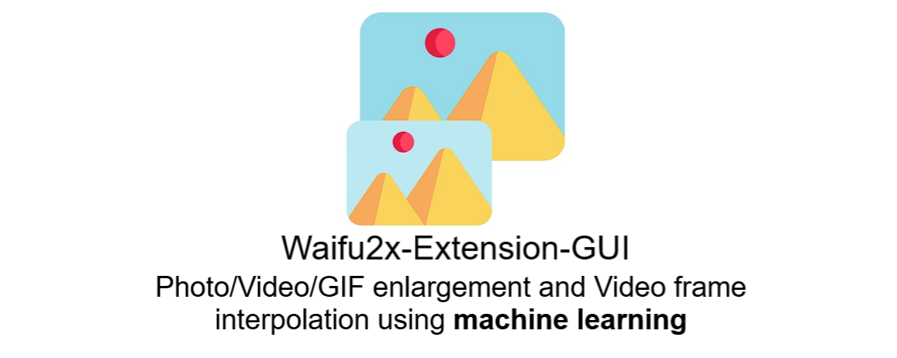

# Waifu2x-Extension-GUI

Waifu2x-Extension-GUI is a Qt based graphical interface for upscaling and denoising images or
videos. The project integrates the RealCUGAN and RealESRGAN upscalers and presents them in a
single GUI.

## Features

- Simple Qt interface supporting image, GIF and video files
- Queue based processing with per-file progress information
- Multi-GPU configuration and compatibility tests
- System tray integration and drag & drop of files
- Preserves transparency by splitting the alpha channel and recombining after upscaling

RealCUGAN and RealESRGAN are currently the only supported upscaling engines.

## Dependencies

- **Qt 5 or Qt 6** development environment (Core, GUI, Widgets, Multimedia modules)
- **C++11** compatible compiler
- **FFmpeg** for handling video input/output
- Included **RealCUGAN** and **RealESRGAN** executables built with ncnn Vulkan

Ensure your GPU drivers support Vulkan since both engines rely on it.

## Build and Run

```bash
# build the main GUI
cd Waifu2x-Extension-QT
qmake Waifu2x-Extension-QT.pro
make

# optional launcher
cd ../Waifu2x-Extension-QT-Launcher
qmake Waifu2x-Extension-QT-Launcher.pro
make
```

After compilation run `Waifu2x-Extension-GUI` (or the launcher) from its build
folder. Place the realcugan-ncnn-vulkan and realesrgan-ncnn-vulkan executables in
the same directory so the GUI can invoke them.

### Thread control

By default the application limits its internal thread pool to twice the number
of detected CPU cores. You can override this via the command line:

```bash
Waifu2x-Extension-GUI --max-threads 8
```
or by editing `settings.ini` and setting `MaxThreadCount`.

## RealCUGAN and RealESRGAN

Both upscalers rely on the ncnn Vulkan backend and run without a Python or CUDA
environment. They accept **JPG**, **PNG** and **WEBP** images and can be used
inside the GUI or from the command line for batch processing. Video files are
handled by extracting frames with FFmpeg and merging them after upscaling.

### Downloading binaries and models

The GUI expects the RealCUGAN and RealESRGAN executables with their `models`
folders to reside next to the application. Portable archives for all platforms
are available on the official release pages:

- [realcugan-ncnn-vulkan releases](https://github.com/nihui/realcugan-ncnn-vulkan/releases)
- [realesrgan-ncnn-vulkan releases](https://github.com/xinntao/Real-ESRGAN/releases)

Download and extract the archive for your operating system, then copy the
contents so that `realcugan-ncnn-vulkan` and `realesrgan-ncnn-vulkan` can be
found in the same directory as `Waifu2x-Extension-GUI`.

### Command line examples

RealCUGAN can denoise and upscale anime imagery, while RealESRGAN offers models
for general photos as well as anime. Typical invocations are:

```bash
# RealCUGAN 2x with light noise reduction
realcugan-ncnn-vulkan -i input.jpg -o output.png -n 1 -s 2

# RealESRGAN using the x4plus model
realesrgan-ncnn-vulkan -i input.jpg -o output.png -n realesrgan-x4plus -s 4
```

### Screenshot

Below is the start-up screen of the optional launcher:



### Troubleshooting

- Ensure your GPU drivers are up to date if Vulkan initialization fails.
- Lower the `tile-size` option when running out of GPU memory.
- Verify the `models` folders are present beside the executables.
- Refer to the [Real-CUGAN](https://github.com/bilibili/ailab/tree/main/Real-CUGAN)
  and [Real-ESRGAN](https://github.com/xinntao/Real-ESRGAN) documentation for
  detailed usage and model descriptions.

## Tests

The repository includes Pytest cases which exercise the RealCUGAN and RealESRGAN
binaries on small sample images. Running the suite requires the `pytest` Python
package and an internet connection. The tests automatically download the Linux
releases of both upscalers if the executables are not present and place them in
`tests/bin/`.

To execute the tests from the repository root simply run:

```bash
pytest
```

The sample images used for testing are located under
`realcugan-ncnn-vulkan SRC/images/` and in the
`realesrgan-ncnn-vulkan-20220424-windows` folder.
