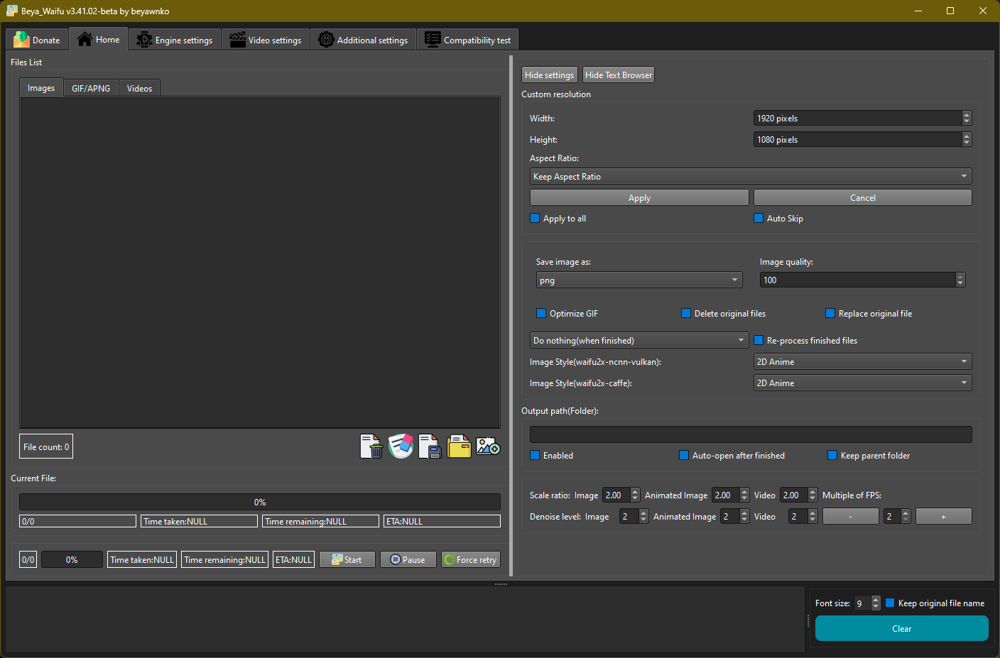

# Beya_Waifu

Beya_Waifu is a Qt6 based graphical interface for upscaling and denoising images or videos. The project integrates the
RealCUGAN and RealESRGAN upscalers and presents them in a single GUI. Project is inspired by the original version of
Waifu2x_GUI by @AaronFeng753.

## Features

- Advanced featured Qt interface with a simple layout supporting image, GIF and video files
- Queue based processing with per-file progress information
- Multi-GPU configuration and compatibility tests
- System tray integration and drag & drop of files
- Preserves transparency by splitting the alpha channel and recombining after upscaling
- Optional Liquid Glass shader providing a translucent glass effect

RealCUGAN and RealESRGAN are currently the only supported upscaling engines.

## Dependencies

 - **Qt 6** development environment (Core, GUI, Widgets, Multimedia, OpenGL, OpenGLWidgets, ShaderTools, Quick, Quick3D modules). For full RHI support including the Liquid Glass effect, Qt 6.6.0 or newer is recommended.
- **C++17** compatible compiler (I am currently in the process of working on experimental refactoring to C++20 for
  coroutines)
- **FFmpeg** for handling video input/output
- Included **RealCUGAN** and **RealESRGAN** executables built with ncnn Vulkan
- Qt6 shadertools package providing the `qsb` tool for the Liquid Glass shader (inspired by current modern UI design)

Ensure your GPU drivers support Vulkan since both engines rely on it.

## GPU detection

The application queries available Vulkan devices by invoking the bundled upscaler binaries with the `-h` option. The
output lists devices as `GPU device <id>: <name>` or `[<id>] <name>` which is parsed to populate the GPU selection
menus. Detected IDs are saved to `settings.ini` so that subsequent launches restore the last known device list.

### Quick Build (Linux & Windows)

1. Install **Qt 6.6.3 or newer** with the Core, Gui, Widgets, Multimedia, OpenGL, OpenGLWidgets, ShaderTools, Quick, and Quick3D modules. A C++17 compiler is required (GCC 7+ on Linux or the MSYS2 MinGW-w64 toolchain on Windows).
1. Clone the repository and its submodules:
   ```bash
   git clone --recursive https://github.com/beyawnko/Beya_Waifu.git
   cd Beya_Waifu
   ```
   Qt's `uic` tool generates `ui_mainwindow.h` from `mainwindow.ui` during the
   build. If you need to regenerate this header manually, run:
   ```bash
   uic Waifu2x-Extension-QT/mainwindow.ui -o ui_mainwindow.h
   ```
   The previous `captured_ui_mainwindow.h.txt` snapshot has been removed and is
   no longer needed.
1. Build all components with the helper script:
   ```bash
   ./build_projects.sh
   ```
1. After building, install the Python requirements and run the unit tests:
   ```bash
   pip install -r requirements.txt
   pytest
   ```

## Building from Source

This project can be built on Linux and Windows. The `build_projects.sh` script in the root directory is designed to
automate the building of the main application, the launcher, and the required upscaler engines (RealCUGAN and
RealESRGAN).

### Windows

To build the project on Windows, use the `build_windows.ps1` PowerShell script located in the root of the repository.

**Prerequisites:**

- Windows Operating System (10 or later recommended)
- PowerShell
- Git client (must be in PATH)
- An active internet connection (the script downloads dependencies)
- Administrator privileges (the script installs software like Chocolatey, MSYS2, Qt, and build tools if not already
  present)

**Steps:**

1. Ensure Git submodules are initialized and updated: `git submodule update --init --recursive`
1. Open a PowerShell terminal with Administrator privileges.
1. Navigate to the root directory of the repository.
1. Execute the build script: `.\build_windows.ps1`

The `build_windows.ps1` script will perform the following:

- Install Chocolatey (a package manager for Windows) if not already present.
- Install necessary tools via Chocolatey, including MSYS2 (for a Unix-like environment on Windows), CMake, Git (if not
  already fully available), and Python.
- Set up the MSYS2/MinGW64 build environment.
- Install the required version of Qt (currently 6.6.3 for MinGW, matching the `build_windows.ps1` script) using `aqtinstall`.
- Execute the main build script (`build_projects.sh`) which compiles the Waifu2x Extension QT application and the
  Launcher.
- **Deployment:** After a successful compilation, the script automatically bundles the necessary Qt runtime DLLs (using
  `windeployqt`) and copies essential MinGW runtime DLLs into the respective `release` output directories
  (`Waifu2x-Extension-QT/release` and `Waifu2x-Extension-QT-Launcher/release`). This makes the compiled applications
  portable and ready to run on other Windows machines that may not have Qt or MinGW installed.

The final executables and their bundled dependencies will be found in the `Waifu2x-Extension-QT/release/` and
`Waifu2x-Extension-QT-Launcher/release/` directories.

### Prerequisites

First, ensure you have Git installed to clone the repository and its submodules.

**1. Clone the Repository:** Use the following command to clone the repository including its submodules:

```bash
git clone --recursive https://github.com/beyawnko/Beya_Waifu.git
cd Beya_Waifu
```

If you have already cloned the repository without the `--recursive` flag, navigate to the repository's root directory
and run the following commands to initialize and fetch the submodules:

```bash
git submodule update --init --recursive
```

### Linux Dependencies

1. **Compiler and Core Build Tools**:

   - A C++17 compatible compiler (e.g., GCC `g++` version 7 or later).
   - `make`
   - `cmake` (version 3.9 or later is recommended for building the upscaler submodules).
   - Installation example for Debian/Ubuntu systems:
     ```bash
     sudo apt update
     sudo apt install build-essential g++ make cmake
     ```

1. **Qt Development Libraries**:

  - Qt 6 (e.g., version 6.6.3 or newer). You'll need the `core`, `gui`, `widgets`, `multimedia`, `quick`, `quick3d` components,
    along with the `opengl`, `openglwidgets`, and `shadertools` modules. For RHI-based features like LiquidGlass, Qt 6.6.0+ is necessary.
   - Installation example for Debian/Ubuntu systems:
     ```bash
    sudo apt install qt6-base-dev qt6-base-dev-tools qt6-multimedia-dev qt6-shadertools-dev
     ```
   - If you are using a specific Qt version manager (like `aqtinstall`), ensure that the chosen Qt version's `bin`
     directory is in your system's `PATH`.

#### Qt 6 Packages

For a Qt6 environment (preferred) you can install the following packages on Debian/Ubuntu systems:

```bash
sudo apt install qt6-base-dev qt6-base-dev-tools qt6-multimedia-dev qt6-shadertools-dev
```
These packages supply `qmake6`, `qsb`, and the Multimedia modules.

3. **Upscaler Dependencies (Vulkan)**:
   - The upscaler engines (RealCUGAN, RealESRGAN) are based on ncnn and use Vulkan for GPU acceleration.
   - **Vulkan SDK**: Download and install the Vulkan SDK from the [LunarG website](https://vulkan.lunarg.com/). Follow
     their official installation instructions for your Linux distribution.
   - Ensure that the `VULKAN_SDK` environment variable is set correctly, or that CMake can otherwise locate your Vulkan
     headers and libraries.
   - The upscaler submodules (`realcugan-ncnn-vulkan`, `realesrgan-ncnn-vulkan`) bundle `ncnn` and `glslang` as their
     own submodules, which are typically built locally by CMake during the upscaler build process.

### Windows Dependencies (Using MSYS2/MinGW)

1. **MSYS2 Environment**:

   - Download and install MSYS2 from [www.msys2.org](https://www.msys2.org/).
   - After installation, open an MSYS2 terminal and update the package database and core packages by running:
     ```bash
     pacman -Syu
     pacman -Su
     ```
     (You might need to close and reopen the terminal between these commands as instructed by MSYS2).
   - Install the MinGW-w64 toolchain (for 64-bit builds), CMake, and Git. Open an "MSYS2 MinGW 64-bit" terminal and run:
     ```bash
     pacman -S --needed git mingw-w64-x86_64-toolchain mingw-w64-x86_64-cmake mingw-w64-x86_64-make
     ```

1. **Qt for MinGW**:

   - Install a MinGW-compatible version of Qt 6 (e.g., Qt 6.6.3 or newer, matching the `build_windows.ps1` script). You can get this via the Qt Online Installer available
     from the [official Qt website](https://www.qt.io/download-qt-installer) or use `aqtinstall` as done by the `build_windows.ps1` script.
   - During the Qt installation (if manual), ensure you select a Qt version built for MinGW (e.g., `mingw_64` for Qt 6.6.3 if you
     installed the `mingw-w64-x86_64` toolchain).
   - Ensure that the `bin` directory of your Qt installation (e.g., `C:\Qt\6.6.3\mingw_64\bin`) and the MinGW compiler
     `bin` directory (e.g., `C:\msys64\mingw64\bin`) are added to your system's `PATH` environment variable, especially
     within the MSYS2 MinGW terminal environment.
   - Include the **qtshadertools**, **qtquick**, and **qtquick3d** modules. For RHI-based features like LiquidGlass, Qt 6.6.0+ is necessary.
    - Install the `opengl` and `openglwidgets` modules.

1. **Upscaler Dependencies (Vulkan for Windows)**:

   - As with Linux, install the Vulkan SDK from the [LunarG website](https://vulkan.lunarg.com/).
   - The `build_projects.sh` script will prioritize using pre-built Windows upscaler binaries if they are present in the
     repository. If not, it will attempt to build them from source using CMake, which will require the Vulkan SDK to be
     correctly installed and discoverable.

### Building the Application

Once all dependencies are set up correctly for your operating system:

**Note:** The project is configured to use the C++17 standard, aligning with the requirements of Qt 6 and modern C++
practices.

1. Open your terminal (MSYS2 MinGW 64-bit on Windows, or a standard bash terminal on Linux).
1. Navigate to the root directory of the cloned `Waifu2x-Extension-QT` repository.
1. Execute the build script:
   ```bash
   ./build_projects.sh
   ```
1. Upon successful completion:
   - The main application executable (`Beya_Waifu.exe` on Windows, `Beya_Waifu` on Linux) and the upscaler binaries will
     be located in the `Waifu2x-Extension-QT/` directory.
   - The launcher application will be in the `Waifu2x-Extension-QT-Launcher/` directory.

This process compiles the upscalers from source (or copies prebuilt versions on Windows) and then builds the Qt GUI
application and launcher.

### Windows One-Click Build

Run the PowerShell helper to install the required toolchain and build the project automatically:

```powershell
powershell -ExecutionPolicy Bypass -File .\build_windows.ps1
```

The script requires administrator privileges because it installs packages via Chocolatey. It will fetch Qt through
`aqtinstall` if `qmake` is not available and ensures the **qtshadertools** module is present for the Liquid Glass
shader. By default Qt is installed to `C:\tmp\Qt`. If you use the `-QtDir` argument, provide an absolute Windows path
such as `C:\Qt` so the script can correctly locate Qt.

## Development Environment

Set up a Python virtual environment to run the helper scripts and tests.

```bash
python -m venv venv
```

Activate the environment and install the dependencies:

- **Windows**
  ```bat
  venv\Scripts\activate.bat
  ```
- **Linux/macOS**
  ```bash
  source venv/bin/activate
  ```

Install the required packages then build the project inside the environment:

```bash
pip install -r requirements.txt
# Note: ./build_projects.sh is covered in "Building the Application"
# and is primarily for the C++ components, not Python environment setup.
```

When running tests without a display server set `QT_QPA_PLATFORM=offscreen` so Qt does not attempt to load a GUI
backend.

### Thread control

By default the application limits its internal thread pool to twice the number of detected CPU cores. You can override
this via the command line:

```bash
Beya_Waifu --max-threads 8
```

### Debug logging

Qt debug output can be redirected to a log file under `logs/` by enabling verbose mode.
Run the application with `--verbose` to capture detailed logs in `logs/waifu.log`.

## Liquid Glass

The application ships with an experimental Liquid Glass shader that creates a refractive glass sphere from the scene
behind it. Building this effect requires the `qsb` tool provided by Qt 6's ShaderTools module. The CMake build system
(`Waifu2x-Extension-QT/CMakeLists.txt`) uses the `qt_add_shaders` function to compile the `shaders/liquidglass.frag`
shader into `shaders/liquidglass.frag.qsb` and embed it into the application resources.
Ensure that Qt (version 6.6.0 or newer for RHI features) is correctly installed and its ShaderTools (including `qsb`)
are available in your build environment. If you encounter issues with missing shader files, ensure your CMake configuration
can find your Qt installation and that the ShaderTools component was installed.
If you cloned the repository without build artifacts and need to manually build the shader (though CMake should handle this):

```bash
./tools/build_liquidglass_shader.sh
```
The Liquid Glass shader parameters (resolution, time, mouse, IOR, etc.) are now passed via a Uniform Buffer Object (UBO).
This change in `liquidglass.frag` requires corresponding setup in `LiquidGlassWidget.cpp` to define, populate, and bind this UBO.

### Demo

Run a minimal example from the `examples` folder with the Qt `qml` runtime:

```bash
cd examples
qml LiquidGlassDemo.qml
```

### QML usage

```qml
import QtQuick
import "../Waifu2x-Extension-QT/qml" as Effects

Effects.LiquidGlass {
    anchors.fill: parent
    sourceItem: background
}
```

### C++ usage

```cpp
#include "LiquidGlassWidget.h"

auto *glass = new LiquidGlassWidget(this);
glass->setBackground(QImage("background.jpg"));
glass->setRefractionScale(1.33f);
```

### Main window integration

The Settings panel exposes a checkbox labeled **Enable Liquid Glass**. Toggling this option overlays a refractive sphere
on the central widget using the `icon/BackgroundMode.png` texture as its environment. The overlay resizes with the window
and can be enabled or disabled at runtime.

## RealCUGAN and RealESRGAN

Both upscalers rely on the ncnn Vulkan backend and run without a Python or CUDA environment. They accept **JPG**,
**PNG** and **WEBP** images and can be used inside the GUI or from the command line for batch processing. Video files
are handled by extracting frames with FFmpeg and merging them after upscaling.

The `build_projects.sh` script handles acquiring and placing the upscaler executables and their models into the correct
location (`Waifu2x-Extension-QT/`). For Windows, it prioritizes prebuilt binaries from the repository, and for Linux (or
if Windows prebuilts are missing), it builds them from source. Models are also copied from the respective submodule's
`models` directory or prebuilt directories. If these model folders are absent or empty, the script prints a warning and
skips the copy step so the build can still succeed.

### Command line examples

RealCUGAN can denoise and upscale anime imagery, while RealESRGAN offers models for general photos as well as anime.
After the **Simple_Compatibility_Test** runs, the application toggles the
`widget_RealCUGAN_Hidden` panel based on whether `realcugan-ncnn-vulkan`
is present. This is done via
`widget_RealCUGAN_Hidden->setVisible(isCompatible_RealCUGAN_NCNN_Vulkan)`
so the settings only appear when the executable is available.
Typical invocations are:

```bash
# RealCUGAN 2x with light noise reduction
realcugan-ncnn-vulkan -i input.jpg -o output.png -n 1 -s 2

# RealESRGAN using the x4plus model
realesrgan-ncnn-vulkan -i input.jpg -o output.png -n realesrgan-x4plus -s 4
```

### Unsupported scales

If a scale not natively provided by the selected RealESRGAN model is requested, the application repeats the model until
the next higher multiple is reached. When this happens a message is emitted indicating that manual downscaling may be
required. If the computed sequence cannot satisfy the requested scale at all the operation fails with an error.

### Screenshot

Below is the start-up screen of the optional launcher:


Early WIP Main Menu layout:



### Troubleshooting

- Ensure your GPU drivers are up to date if Vulkan initialization fails.
- Lower the `tile-size` option when running out of GPU memory.
- Verify the `models` folders are present beside the executables.
- Refer to the [Real-CUGAN](https://github.com/bilibili/ailab/tree/main/Real-CUGAN) and
  [Real-ESRGAN](https://github.com/xinntao/Real-ESRGAN) documentation for detailed usage and model descriptions.
- Install the packages from `requirements.txt` before running `pytest` or you will encounter `ImportError` messages for
  modules such as `PySide6` and `Pillow`.
  - When `simple_build.sh` or the GUI tests fail with errors about `*.qsb` files, install the Qt 6 shader tools package and
    regenerate `shaders/liquidglass.frag.qsb` using `./tools/build_liquidglass_shader.sh`.

## Tests

The repository includes Pytest cases which exercise the RealCUGAN and RealESRGAN binaries on small sample images.
Running the suite requires the `pytest` package. An internet connection is also needed for downloading the upscaler
binaries.

Install the packages listed in `requirements.txt` before running `pytest`:

```bash
pip install -r requirements.txt
```

If `tests/test_qml_liquidglass.py` warns that `shaders/liquidglass.frag.qsb` is missing, run:

```bash
./tools/build_liquidglass_shader.sh
```

`PySide6` and `Pillow` are required, and missing either will cause `ImportError` failures in the tests. The suite
automatically downloads the Linux releases of both upscalers if the executables are not present and places them in
`tests/bin/`.

The tests under `ncnn/tools/pnnx/tests` rely on the PyTorch ecosystem. Install `torch`,
`torchaudio` and `torchvision` with:

```bash
pip install torch torchaudio torchvision
```

If these packages are missing the entire pnnx test suite is skipped.

To execute the tests from the repository root simply run:

```bash
pytest
```

For a concise checklist when preparing pull requests, see
[CONTRIBUTING.md](CONTRIBUTING.md).

When running the tests without a display server, set the Qt platform to "offscreen" so PySide6 does not attempt to load
the native GUI libraries:

```bash
export QT_QPA_PLATFORM=offscreen
pytest
```

The sample images used for testing are located under `realcugan-ncnn-vulkan/images/` and in the
`realesrgan-ncnn-vulkan/windows` folder.

During CI the Windows workflow captures the pytest output into `tests/windows-test.log` and uploads it as the
**windows-test-logs** artifact. The log can be downloaded from the workflow run's "Artifacts" section.

## Static Analysis

[![cppcheck]][cppcheck-link]

[cppcheck-link]: https://github.com/beyawnko/Beya_Waifu/actions/workflows/cppcheck.yml

Static analysis can be performed with [cppcheck](https://cppcheck.sourceforge.io/). The helper script expects
`cppcheck`, `pkg-config` and the Qt development headers to be present. If `pkg-config` cannot locate Qt, install the
development package providing the Qt pkg-config files (e.g., `qtbase5-dev` or `qtbase6-dev`). On Debian-based
distributions install them with:

```bash
sudo apt-get update
sudo apt-get install qt6-base-dev qt6-base-dev-tools qt6-multimedia-dev \
    qt6-shadertools-dev cppcheck pkg-config
```

Run cppcheck from the repository root:

```bash
./tools/run_cppcheck.sh
```

The helper script automatically applies the arguments listed in `tools/cppcheck.cfg`. This file defines the Qt keywords
(`slots`, `signals`, `Q_OBJECT`, …) so that cppcheck does not warn about them. The results are written to
`cppcheck.log`. A GitHub Actions workflow runs cppcheck on each push and pull request.

[![clazy]][clazy-link]

`clazy` provides Qt-focused checks powered by clang. The helper script requires
`clazy`, `bear` and the Qt development headers. Install them on Debian-based
systems with:

```bash
sudo apt-get update
sudo apt-get install qt6-base-dev qt6-base-dev-tools qt6-multimedia-dev \
    qt6-shadertools-dev clazy bear
```

Run clazy from the repository root:

```bash
./tools/run_clazy.sh
```

The script builds the project with clang under `bear` to capture compile
commands and then runs `clazy-standalone`. The results are written to
`clazy.log`. A GitHub Actions workflow executes clazy on each push and pull
request.

[clazy-link]: https://github.com/beyawnko/Beya_Waifu/actions/workflows/clazy.yml
