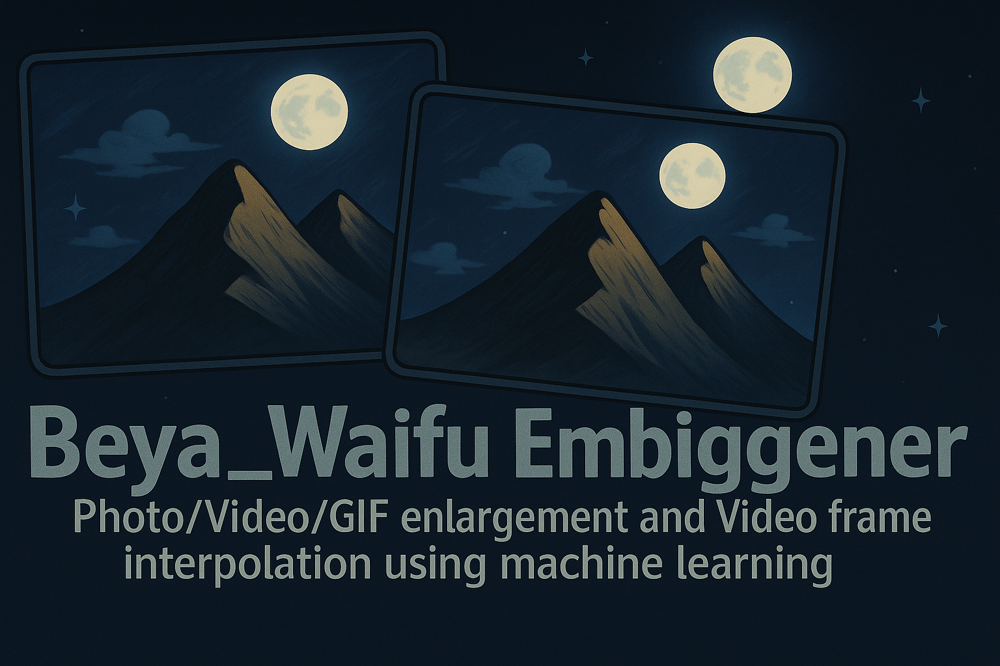

# Beya_Waifu

Beya_Waifu is a Qt based graphical interface for upscaling and denoising images or
videos. The project integrates the RealCUGAN and RealESRGAN upscalers and presents them in a
single GUI.

## Features

- Simple Qt interface supporting image, GIF and video files
- Queue based processing with per-file progress information
- Multi-GPU configuration and compatibility tests
- System tray integration and drag & drop of files
- Preserves transparency by splitting the alpha channel and recombining after upscaling
- Optional Liquid Glass shader providing a translucent glass effect

RealCUGAN and RealESRGAN are currently the only supported upscaling engines.

## Dependencies

- **Qt 5 or Qt 6** development environment (Core, GUI, Widgets, Multimedia modules)
- **C++11** compatible compiler
- **FFmpeg** for handling video input/output
- Included **RealCUGAN** and **RealESRGAN** executables built with ncnn Vulkan
- Qt6 shadertools package providing the `qsb` tool for the Liquid Glass shader

Ensure your GPU drivers support Vulkan since both engines rely on it.

## Building from Source

This project can be built on Linux and Windows. The `build_projects.sh` script in the root directory is designed to automate the building of the main application, the launcher, and the required upscaler engines (RealCUGAN and RealESRGAN).

### Prerequisites

First, ensure you have Git installed to clone the repository and its submodules.

**1. Clone the Repository:**
Use the following command to clone the repository including its submodules:
```bash
git clone --recursive https://github.com/AaronFeng753/Waifu2x-Extension-QT.git
cd Waifu2x-Extension-QT
```
If you have already cloned the repository without the `--recursive` flag, navigate to the repository's root directory and run the following commands to initialize and fetch the submodules:
```bash
git submodule update --init --recursive
```

### Linux Dependencies

1.  **Compiler and Core Build Tools**:
    *   A C++11 compatible compiler (e.g., GCC `g++` version 7 or later).
    *   `make`
    *   `cmake` (version 3.9 or later is recommended for building the upscaler submodules).
    *   Installation example for Debian/Ubuntu systems:
        ```bash
        sudo apt update
        sudo apt install build-essential g++ make cmake
        ```

2.  **Qt Development Libraries**:
    *   Qt 5 (e.g., version 5.12 or 5.15). You'll need the `core`, `gui`, `widgets`, and `multimedia` components.
    *   Installation example for Debian/Ubuntu systems:
        ```bash
        sudo apt install qtbase5-dev qtmultimedia5-dev libqt5svg5-dev
        ```
    *   If you are using a specific Qt version manager (like `aqtinstall`), ensure that the chosen Qt version's `bin` directory is in your system's `PATH`.

3.  **Upscaler Dependencies (Vulkan)**:
    *   The upscaler engines (RealCUGAN, RealESRGAN) are based on ncnn and use Vulkan for GPU acceleration.
    *   **Vulkan SDK**: Download and install the Vulkan SDK from the [LunarG website](https://vulkan.lunarg.com/). Follow their official installation instructions for your Linux distribution.
    *   Ensure that the `VULKAN_SDK` environment variable is set correctly, or that CMake can otherwise locate your Vulkan headers and libraries.
    *   The upscaler submodules (`realcugan-ncnn-vulkan`, `realesrgan-ncnn-vulkan`) bundle `ncnn` and `glslang` as their own submodules, which are typically built locally by CMake during the upscaler build process.

### Windows Dependencies (Using MSYS2/MinGW)

1.  **MSYS2 Environment**:
    *   Download and install MSYS2 from [www.msys2.org](https://www.msys2.org/).
    *   After installation, open an MSYS2 terminal and update the package database and core packages by running:
        ```bash
        pacman -Syu
        pacman -Su
        ```
        (You might need to close and reopen the terminal between these commands as instructed by MSYS2).
    *   Install the MinGW-w64 toolchain (for 64-bit builds), CMake, and Git. Open an "MSYS2 MinGW 64-bit" terminal and run:
        ```bash
        pacman -S --needed git mingw-w64-x86_64-toolchain mingw-w64-x86_64-cmake mingw-w64-x86_64-make
        ```

2.  **Qt for MinGW**:
    *   Install a MinGW-compatible version of Qt 5 (e.g., Qt 5.15.2). You can get this via the Qt Online Installer available from the [official Qt website](https://www.qt.io/download-qt-installer).
    *   During the Qt installation, ensure you select a Qt version built for MinGW (e.g., `mingw81_64` for Qt 5.15.2 if you installed the `mingw-w64-x86_64` toolchain).
    *   Ensure that the `bin` directory of your Qt installation (e.g., `C:\Qt\5.15.2\mingw81_64\bin`) and the MinGW compiler `bin` directory (e.g., `C:\msys64\mingw64\bin`) are added to your system's `PATH` environment variable, especially within the MSYS2 MinGW terminal environment.

3.  **Upscaler Dependencies (Vulkan for Windows)**:
    *   As with Linux, install the Vulkan SDK from the [LunarG website](https://vulkan.lunarg.com/).
    *   The `build_projects.sh` script will prioritize using pre-built Windows upscaler binaries if they are present in the repository. If not, it will attempt to build them from source using CMake, which will require the Vulkan SDK to be correctly installed and discoverable.

### Building the Application

Once all dependencies are set up correctly for your operating system:

1.  Open your terminal (MSYS2 MinGW 64-bit on Windows, or a standard bash terminal on Linux).
2.  Navigate to the root directory of the cloned `Waifu2x-Extension-QT` repository.
3.  Execute the build script:
    ```bash
    ./build_projects.sh
    ```
4.  Upon successful completion:
    *   The main application executable (`Beya_Waifu.exe` on Windows, `Beya_Waifu` on Linux) and the upscaler binaries will be located in the `Waifu2x-Extension-QT/` directory.
    *   The launcher application will be in the `Waifu2x-Extension-QT-Launcher/` directory.

This process compiles the upscalers from source (or copies prebuilt versions on Windows) and then builds the Qt GUI application and launcher.

## Development Environment

Set up a Python virtual environment to run the helper scripts and tests.

```bash
python -m venv venv
```

Activate the environment and install the dependencies:

- **Windows**
  ```bat
  venv\Scripts\activate.bat
  ```
- **Linux/macOS**
  ```bash
  source venv/bin/activate
  ```

Install the required packages then build the project inside the environment:

```bash
pip install -r requirements.txt
# Note: ./build_projects.sh is covered in "Building the Application"
# and is primarily for the C++ components, not Python environment setup.
```

When running tests without a display server set `QT_QPA_PLATFORM=offscreen` so
Qt does not attempt to load a GUI backend.

### Thread control

By default the application limits its internal thread pool to twice the number
of detected CPU cores. You can override this via the command line:

```bash
Beya_Waifu --max-threads 8
```

## Liquid Glass

The application ships with an experimental Liquid Glass shader that creates a
refractive glass sphere from the scene behind it. Building this effect requires
the `qsb` tool provided by Qt 6. The `Waifu2x-Extension-QT.pro` file runs `qsb`
automatically and writes `shaders/liquidglass.frag.qsb`. Ensure the tool is
available in `PATH` when invoking `qmake`.

### Demo

Run a minimal example from the `examples` folder with the Qt `qml` runtime:

```bash
cd examples
qml LiquidGlassDemo.qml
```

### QML usage

```qml
import QtQuick
import "../Waifu2x-Extension-QT/qml" as Effects

Effects.LiquidGlass {
    anchors.fill: parent
    sourceItem: background
}
```

### C++ usage

```cpp
#include "LiquidGlassWidget.h"

auto *glass = new LiquidGlassWidget(this);
glass->setBackground(QImage("background.jpg"));
glass->setRefractionScale(1.33f);
```

## RealCUGAN and RealESRGAN

Both upscalers rely on the ncnn Vulkan backend and run without a Python or CUDA
environment. They accept **JPG**, **PNG** and **WEBP** images and can be used
inside the GUI or from the command line for batch processing. Video files are
handled by extracting frames with FFmpeg and merging them after upscaling.

The `build_projects.sh` script handles acquiring and placing the upscaler executables and their models into the correct location (`Waifu2x-Extension-QT/`). For Windows, it prioritizes prebuilt binaries from the repository, and for Linux (or if Windows prebuilts are missing), it builds them from source. Models are also copied from the respective submodule's `models` directory or prebuilt directories.

### Command line examples

RealCUGAN can denoise and upscale anime imagery, while RealESRGAN offers models
for general photos as well as anime. Typical invocations are:

```bash
# RealCUGAN 2x with light noise reduction
realcugan-ncnn-vulkan -i input.jpg -o output.png -n 1 -s 2

# RealESRGAN using the x4plus model
realesrgan-ncnn-vulkan -i input.jpg -o output.png -n realesrgan-x4plus -s 4
```

### Unsupported scales

If a scale not natively provided by the selected RealESRGAN model is requested,
the application repeats the model until the next higher multiple is reached.
When this happens a message is emitted indicating that manual downscaling may be
required. If the computed sequence cannot satisfy the requested scale at all the
operation fails with an error.

### Screenshot

Below is the start-up screen of the optional launcher:



### Troubleshooting

- Ensure your GPU drivers are up to date if Vulkan initialization fails.
- Lower the `tile-size` option when running out of GPU memory.
- Verify the `models` folders are present beside the executables.
- Refer to the [Real-CUGAN](https://github.com/bilibili/ailab/tree/main/Real-CUGAN)
  and [Real-ESRGAN](https://github.com/xinntao/Real-ESRGAN) documentation for
  detailed usage and model descriptions.

## Tests

The repository includes Pytest cases which exercise the RealCUGAN and RealESRGAN binaries
on small sample images. Running the suite requires the `pytest` package. An internet
connection is also needed for downloading the upscaler binaries.

Before running `pytest` install the required Python packages:

```bash
pip install -r requirements.txt
```

This installs both `PySide6` and `Pillow`. These libraries must be present or the tests will
fail. The tests automatically download the Linux releases of both upscalers if the executables
are not present and place them in `tests/bin/`.

To execute the tests from the repository root simply run:

```bash
pytest
```

When running the tests without a display server, set the Qt platform to
"offscreen" so PySide6 does not attempt to load the native GUI libraries:

```bash
export QT_QPA_PLATFORM=offscreen
pytest
```

The sample images used for testing are located under
`realcugan-ncnn-vulkan/images/` and in the
`realesrgan-ncnn-vulkan/windows` folder.

During CI the Windows workflow captures the pytest output into
`tests/windows-test.log` and uploads it as the **windows-test-logs** artifact.
The log can be downloaded from the workflow run's "Artifacts" section.

## Static Analysis
[](https://github.com/<OWNER>/<REPOSITORY>/actions/workflows/cppcheck.yml)

Static analysis can be performed with [cppcheck](https://cppcheck.sourceforge.io/). The helper script expects the Qt development headers, `cppcheck` itself and `pkg-config` to be present. On Debian-based distributions install them with:

```bash
sudo apt-get update
sudo apt-get install qtbase5-dev cppcheck pkg-config
```

Run cppcheck from the repository root:

```bash
./tools/run_cppcheck.sh
```

The helper script automatically applies the arguments listed in
`tools/cppcheck.cfg`. This file defines the Qt keywords (`slots`,
`signals`, `Q_OBJECT`, …) so that cppcheck does not warn about them.
The results are written to `cppcheck.log`. A GitHub Actions workflow runs cppcheck on each push and pull request.
